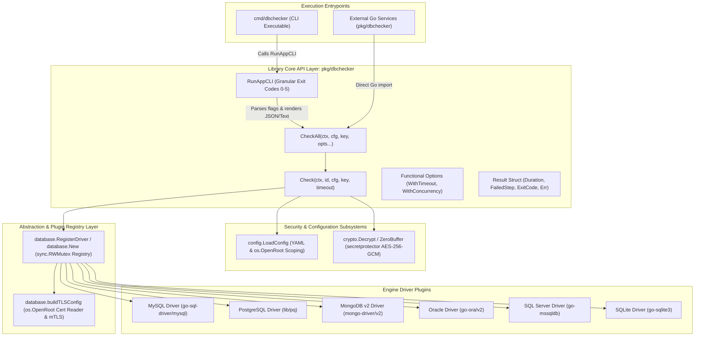
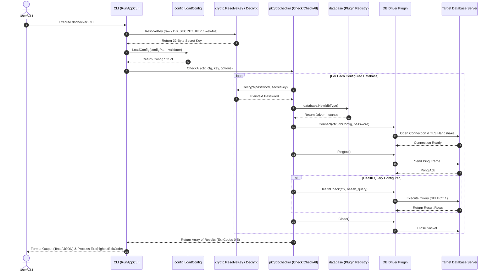

# Architecture - DB Connection Diags (`dbchecker`)

## Overview
DB Connection Diags (`dbchecker`) is a modular Go library and CLI tool engineered for multi-database connectivity verification, latency diagnostic profiling, and health checking across heterogeneous database engines (MySQL, PostgreSQL, MongoDB v2, Oracle, SQL Server, and SQLite). It prioritizes zero-trust security, extensibility through a dynamic plugin registry, and high-concurrency performance.

---

## Component Diagram

The following diagram illustrates the architectural components, entrypoints, core packages, security subsystems, plugin registry, and database engine drivers in `dbchecker`:



---

## 1. Architecture and Design Choices

### Key Architectural Design Choices

1. **Dual Library (`pkg/dbchecker`) and CLI (`cmd/dbchecker`) Structure**:
   - Isolates pure diagnostic business logic into an importable Go library returning strongly-typed `Result` objects with timing metrics and granular exit codes.
   - Shares `pkg/dbchecker.RunAppCLI` between CLI binaries for 100% DRY compliance and zero code duplication.

2. **Granular Diagnostic Process Exit Codes**:
   - Returns specific numeric exit codes (`0` to `5`) to allow automated orchestrators, CI/CD pipelines, container sidecars, and Kubernetes probes to instantly diagnose root failure causes:
     - `0`: Success (All checks passed)
     - `1`: Configuration / CLI flag error
     - `2`: Secret key resolution / OS file permission error
     - `3`: Password decryption failure
     - `4`: Network connection timeout / socket drop
     - `5`: Database ping or healthcheck query failure

3. **Self-Registering Plugin Architecture (`database/`)**:
   - Drivers register factory constructors via `init()` calls (`database.RegisterDriver`).
   - Thread-safe driver factory instantiation (`database.New`) using `sync.RWMutex` locks allows zero-downtime driver additions.

4. **AES-256-GCM Envelope Encryption (`crypto/`)**:
   - Integrates with `criticalsys/secretprotector/pkg/libsecsecrets` to decrypt database passphrases in memory at connection time.
   - Master keys are resolved hierarchically (`raw` string > `DB_SECRET_KEY` env var > `-key-file` path).

5. **Directory Scoping via `os.OpenRoot` (Go 1.24+)**:
   - Replaces traditional un-scoped file opens with `os.OpenRoot` directory handles for loading YAML configuration files, TLS CA certificates, and mTLS keypairs, preventing path traversal vulnerabilities (`../`).

### Core Assumptions
* **Network Reachability**: Target database hosts and ports are accessible from the host environment where `dbchecker` executes.
* **Credential Presence**: Master secret keys are accessible via `DB_SECRET_KEY` or valid key files.
* **Standard SQL / NoSQL Syntax**: Target engines respond to standard ping frames or scalar queries (`SELECT 1;`, `SELECT 1 FROM DUAL;`, or Extended JSON BSON commands).

### Edge Cases Handled
* **Missing or Mismatched mTLS Certificates**: Rejects incomplete client cert/key pairs before initiating network handshakes.
* **Oracle Wallet File Omission**: Enforces non-empty `WalletPath` when `verify-ca` or `verify-full` TLS modes are selected for Oracle.
* **Tampered / Corrupt Base64 Ciphertexts**: Traps AES-GCM authentication tag failures during password decryption and returns a `StepDecryption` failure result (`ExitCode 3`).
* **Unreachable Database Hosts**: Enforces `context.WithTimeout` deadlines to prevent worker routine hangs during socket connections.
* **Zero or Negative Timeouts**: Automatically defaults invalid timeout inputs (`timeout <= 0`) to 10 seconds.

### Performance & Efficiency Optimizations
* **Worker Pool Concurrency**: `CheckAll` employs bounded semaphore channels (`chan struct{}`) to throttle parallel database checks according to `WithConcurrency(n)`, preventing socket exhaustion.
* **Connection Pool Bounds**: Configures `SetMaxOpenConns(1)` and `SetMaxIdleConns(1)` on diagnostic connection handles to avoid socket accumulation during batch checks.
* **In-Memory Credential Decryption**: Passwords are decrypted directly in RAM buffers and never written to disk or temporary files.
* **RAM Hygiene**: `crypto.ZeroBuffer` clears raw key byte arrays immediately after resolution.
* **Fast Failure Categorization**: Short-circuits remaining check phases (`Ping`, `HealthCheck`) if early phases (`Decryption`, `Connect`) fail.

---

## 2. Data Flow and Control Logic

### Operational Control Flow & Code Relations



---

## 3. Dependencies

`dbchecker` relies on standard Go 1.24 runtime libraries, `secretprotector`, and modern third-party database drivers:

* **Go 1.24+ Standard Library**: `crypto/aes`, `crypto/cipher`, `crypto/tls`, `crypto/x509`, `os` (`os.OpenRoot`), `sync`, `context`.
* **Security Subsystem**: `criticalsys/secretprotector/pkg/libsecsecrets` (CSPRNG key generation & AES-256-GCM envelope encryption).
* **MySQL**: `github.com/go-sql-driver/mysql` (Pure Go MySQL driver supporting TLS registration).
* **PostgreSQL**: `github.com/lib/pq` (Pure Go PostgreSQL driver supporting URL DSN parameters for `sslmode`, `sslrootcert`, `sslcert`, and `sslkey`).
* **MongoDB v2**: `go.mongodb.org/mongo-driver/v2` (Official MongoDB Go v2 driver supporting `options.Client().SetTLSConfig` and Extended JSON BSON commands).
* **Oracle**: `github.com/sijms/go-ora/v2` (Pure Go Oracle driver supporting Oracle Wallet TLS connection parameters).
* **SQL Server**: `github.com/microsoft/go-mssqldb` (Official Microsoft SQL Server driver supporting `encrypt`, `trust server certificate`, and `certificate` parameters).
* **SQLite**: `github.com/mattn/go-sqlite3` (CGo SQLite3 driver for in-memory `:memory:` and local disk database files).

---

## 4. Security Architecture

### Security Layers & Defense-in-Depth Diagram

```mermaid
graph TD
    subgraph Layer 1: Secret Key Resolution & OS Permission Defense
        K1["Raw String / Env Var / Key File"] --> K2["libsecsecrets Key Validation"]
        K2 -->|Reject Insecure Paths & Perms| ERR1[Security Error ExitCode 2]
        K2 -->|Valid Key| K3[32-Byte Secret Key]
    end

    subgraph Layer 2: In-Memory Credential Decryption & RAM Hygiene
        K3 --> C1["AES-256-GCM Authenticated Decryption"]
        C1 -->|Nonce & Tag Check| C2["Decrypted Passphrase Buffer"]
        K3 -->|Post-Execution| C3["crypto.ZeroBuffer (RAM Cleared)"]
    end

    subgraph Layer 3: File System Traversal Defense
        F1["Config & TLS Certificate Files"] --> F2["os.OpenRoot(dir) Handle Scoping"]
        F2 -->|Reject Directory Traversal ../| ERR2[Access Denied ExitCode 1]
        F2 -->|Valid Directory File| F3[Scoped File Handle]
    end

    subgraph Layer 4: Transport Layer Security (TLS / mTLS)
        F3 --> T1["buildTLSConfig / TLS Handshake"]
        T1 --> T2["Custom CA Root Verification"]
        T1 --> T3["mTLS Client Cert Authentication"]
        T1 --> T4["Oracle Wallet Encryption"]
    end

    subgraph Layer 5: Database Least-Privilege Operating Model
        T1 --> D1["Unprivileged Connection & Healthcheck Query"]
    end
```

### Access Control & Least-Privilege Model

> [!IMPORTANT]
> **Zero Administrative Privileges Required**: `dbchecker` operates strictly under **Least Privilege**. No `root`, `superuser`, `DBA`, `sysadmin`, or `db_owner` permissions are required on target database systems.

---

## 5. Package Integration

`dbchecker` can be integrated as an importable Go package into external backend applications (such as HTTP health servers like `health-checker`):

```go
package main

import (
	"context"
	"encoding/json"
	"net/http"
	"time"

	"criticalsys.net/dbchecker/config"
	"criticalsys.net/dbchecker/pkg/dbchecker"
)

func HealthCheckHandler(cfg *config.Config, secretKey []byte) http.HandlerFunc {
	return func(w http.ResponseWriter, r *http.Request) {
		ctx := r.Context()
		results := dbchecker.CheckAll(ctx, cfg, secretKey,
			dbchecker.WithTimeout(3*time.Second),
			dbchecker.WithConcurrency(5),
		)

		allHealthy := true
		for _, res := range results {
			if !res.Success {
				allHealthy = false
				break
			}
		}

		w.Header().Set("Content-Type", "application/json")
		if !allHealthy {
			w.WriteHeader(http.StatusServiceUnavailable) // HTTP 503
		} else {
			w.WriteHeader(http.StatusOK) // HTTP 200
		}
		_ = json.NewEncoder(w).Encode(results)
	}
}
```

---

## 6. Database Engine TLS / mTLS Capabilities Matrix

| Database Engine | Supported TLS Modes | Custom Root CA Support | mTLS (Client Cert / Key) | Special TLS Config Notes |
| :--- | :--- | :---: | :---: | :--- |
| **MySQL** | `disable`, `require`, `verify-ca`, `verify-full` | Supported (`root_cert_path`) | Supported (`client_cert_path`, `client_key_path`) | Dynamically registers `tls.Config` via `mysql.RegisterTLSConfig`. |
| **PostgreSQL** | `disable`, `require`, `verify-ca`, `verify-full` | Supported (`sslrootcert`) | Supported (`sslcert`, `sslkey`) | Configured natively via `lib/pq` DSN query parameters. |
| **MongoDB v2** | `disable`, `require`, `verify-ca`, `verify-full` | Supported (`SetTLSConfig`) | Supported (`SetTLSConfig`) | Uses official `mongo-driver/v2` with custom `tls.Config`. |
| **Oracle** | `disable`, `require`, `verify-ca`, `verify-full` | Supported (`WalletPath`) | Supported via Oracle Wallet | `verify-ca` and `verify-full` require a valid Oracle Wallet directory. |
| **SQL Server** | `disable`, `require`, `verify-ca`, `verify-full` | Supported (`certificate`) | System trust store | Configured via `go-mssqldb` URL query parameters (`encrypt`, `certificate`). |
| **SQLite** | N/A (Local / In-Memory) | N/A | N/A | Direct disk file or in-memory `:memory:` database handle. |

---

## 7. Healthcheck Query Specifications & Least-Privilege Account Matrix

| Database Engine | Recommended Health Query | Minimum Account Privileges | Execution Mechanism | Fallback Behavior |
| :--- | :--- | :--- | :--- | :--- |
| **MySQL** | `SELECT 1;` | `USAGE` privilege | `QueryContext` | Connection Ping |
| **PostgreSQL** | `SELECT 1;` | `CONNECT` privilege on database | `QueryContext` | Connection Ping |
| **MongoDB v2** | `{"dbStats": 1}` | `read` role / `listCollections` | `RunCommand` (BSON) | `ListCollectionNames` |
| **Oracle** | `SELECT 1 FROM DUAL;` | `CREATE SESSION` privilege | `QueryContext` | Connection Ping |
| **SQL Server** | `SELECT 1;` | `CONNECT SQL` permission | `QueryContext` | Connection Ping |
| **SQLite** | `SELECT 1;` | Read/Write OS file permissions | `QueryContext` | Connection Ping |
