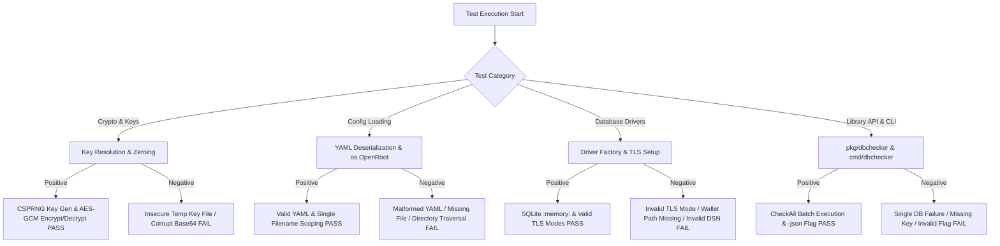

# Testing Documentation & Quality Assurance (`TESTING.md`)

This document outlines the testing architecture, test suite principles, logic flows, execution procedures, setup requirements, and code coverage statistics for **DB Connection Diags (`dbchecker`)**.

---

## 1. Architecture, Design, and Principles of the Test Suite

The `dbchecker` test suite is built according to the following core software engineering principles:

* **High-Impact Instrumentation & Isolation**: Core interfaces (`database.DB`, `crypto`, `config`) are decoupled using dependency injection and dynamic factory registration. Unit tests execute entirely in memory without requiring external database servers or network access.
* **Portable In-Memory Security Instrumentation**: TLS, mTLS, and custom Root CA tests generate native in-memory RSA keypairs and self-signed x509 certificates using standard Go `crypto/x509` and `crypto/rsa` packages. No binary cert files are committed to source control.
* **Hermetic & Cross-Platform Reliability**: Tests utilize `t.TempDir()`, `t.Setenv()`, and `filepath.ToSlash()` to ensure 100% deterministic, cross-platform PASS results on both Windows and Linux OS environments.
* **Layered Testing Pyramid**:
  1. **Unit Tests**: Isolated logic testing for config validation, crypto resolution, envelope encryption/decryption, and driver factory instantiation.
  2. **Mock Driver Integration Tests**: Custom `MockTestDB` and `MockLibDB` drivers simulate network drops, ping failures, query syntax errors, and decryption failures.
  3. **Live E2E CLI Integration Tests**: Full binary lifecycle testing (`RunAppCLI`) verifying key generation, password encryption, YAML scoping via `os.OpenRoot`, and live SQLite database execution.
  4. **Opt-in Remote Cluster Integration Tests**: Environmental harness for testing against live remote MySQL, PostgreSQL, and MongoDB database clusters.

---

## 2. Logic Flow of the Tests

The test suite systematically evaluates both positive (happy path) and negative (error handling) logic flows:



### Main Categories Tested
* **Positive Testing (Happy Path)**:
  * Successful 32-byte key resolution from hex strings or environment variables.
  * Correct AES-256-GCM encryption producing valid Base64 ciphertexts.
  * Decryption of valid ciphertexts matching original plaintexts.
  * Complete connection, ping, and healthcheck query execution against in-memory and file-based SQLite databases.
  * Multi-driver TLS configuration generation (`disable`, `require`, `verify-ca`, `verify-full`).
  * Concurrent batch database checks using `pkg/dbchecker.CheckAll` with functional options.
  * CLI flag execution (`-version`, `-encrypt`, `-config`, `-db`, `-timeout`, `-concurrency`, `-json`).

* **Negative Testing (Error Path Verification)**:
  * Rejection of insecure key file permissions or volatile key file locations.
  * Decryption failures when ciphertexts are tampered with or corrupt.
  * Validation errors for unsupported database driver types.
  * Correct categorization of failure steps (`StepDecryption`, `StepDriverInit`, `StepConnect`, `StepPing`, `StepHealthCheck`) and exit codes (0 to 5).
  * Connection failure detection when target database hosts or ports are unreachable.
  * Handling of invalid SQL query syntax during healthcheck execution.
  * Panic safety when registering nil driver factory functions.

---

## 3. Technical Requirements and Setup

### Prerequisites & Dependencies
* **Go Compiler**: Go 1.24+ (required for `os.OpenRoot` directory scoping features).
* **Dependencies**: Standard Go toolchain dependencies (`criticalsys/secretprotector/pkg/libsecsecrets`, database drivers).
* **OS Compatibility**: Fully supported on Windows (PowerShell / CMD) and Linux / macOS (Bash / Zsh).

### Environment Variables
| Environment Variable | Description | Required For |
| :--- | :--- | :--- |
| `DB_SECRET_KEY` | 64-character hex master key used for AES-GCM password encryption/decryption. | CLI execution & unit tests |
| `LIVE_MYSQL_HOST`, `LIVE_MYSQL_USER`, `LIVE_MYSQL_PASS`, `LIVE_MYSQL_DB` | Connection details for live remote MySQL server integration tests. | Opt-in live integration tests |
| `LIVE_POSTGRES_HOST`, `LIVE_POSTGRES_USER`, `LIVE_POSTGRES_PASS`, `LIVE_POSTGRES_DB` | Connection details for live remote PostgreSQL server integration tests. | Opt-in live integration tests |
| `LIVE_MONGO_HOST`, `LIVE_MONGO_USER`, `LIVE_MONGO_PASS`, `LIVE_MONGO_DB` | Connection details for live remote MongoDB cluster integration tests. | Opt-in live integration tests |

---

## 4. List of Tests

| Logical Group | Test Name | Technical Purpose / Description | Success Criteria (PASS/FAIL) |
| :--- | :--- | :--- | :--- |
| **Crypto** | `TestCryptoIntegration` | Verifies key resolution from env/raw strings, AES-256-GCM encryption/decryption, Base64 formatting, and RAM buffer zeroing via `crypto.ZeroBuffer`. | **PASS**: Decrypted plaintext matches original; buffer zeroed. **FAIL**: Ciphertext mismatch or zeroing error. |
| **Config** | `TestLoadConfigAndValidation` | Verifies YAML config unmarshaling, single filename path resolution, `os.OpenRoot` scoping, and driver validation callback execution. | **PASS**: Valid config returned. **FAIL**: Unmarshaling or validation error. |
| **Config** | `TestInvalidConfigValidation` | Verifies rejection of configurations containing unsupported database driver types or invalid TLS mode strings. | **PASS**: Error returned. **FAIL**: Invalid config accepted. |
| **Config** | `TestLoadConfigErrors` | Verifies graceful error handling for missing YAML config files, empty paths, or unreadable directories. | **PASS**: Specific error returned. **FAIL**: Panic or nil error. |
| **Database** | `TestFactorySupportedDrivers` | Tests dynamic instantiation of all 6 supported database drivers (`mysql`, `postgres`, `oracle`, `sqlserver`, `sqlite`, `mongodb`) via driver registry. | **PASS**: Driver instance created. **FAIL**: Driver lookup error. |
| **Database** | `TestFactoryUnsupportedDriver` | Tests error handling when requesting an unregistered database driver type string. | **PASS**: Unsupported driver error. **FAIL**: Non-nil driver returned. |
| **Database** | `TestIsSupportedFunction` | Tests `database.IsSupported` verification callback across supported and unsupported driver strings. | **PASS**: True for supported engines, false otherwise. **FAIL**: Incorrect driver validation. |
| **Database** | `TestNilSafetyOnUninitializedDrivers` | Verifies that calling `Ping()` or `HealthCheck()` on uninitialized driver structs returns an error without panicking. | **PASS**: Error returned without panic. **FAIL**: Runtime panic occurs. |
| **Database** | `TestSQLiteDriverLifecycle` | Tests real SQLite database engine lifecycle: `Connect`, `Ping`, `HealthCheck` (`SELECT 1;`), invalid SQL syntax rejection, and `Close`. | **PASS**: Queries succeed; invalid SQL returns error. **FAIL**: Execution error. |
| **Database** | `TestDriverConnectValidDSNs` | Verifies DSN format string construction and connection options across all supported database drivers. | **PASS**: DSN formatted correctly. **FAIL**: DSN syntax error. |
| **Database** | `TestDriverConnectVariousTLSModes` | Verifies TLS configuration generation for `disable`, `require`, `verify-ca`, and `verify-full` modes across drivers. | **PASS**: TLS config created. **FAIL**: Invalid TLS options generated. |
| **Database** | `TestDriverConnectInvalidTLSModes` | Tests rejection of invalid or unknown `tls_mode` strings across all database drivers. | **PASS**: Validation error returned. **FAIL**: Invalid mode accepted. |
| **Database** | `TestOracleDriverWalletValidation` | Verifies that Oracle driver requires a non-empty `WalletPath` when using `verify-ca` or `verify-full` TLS modes. | **PASS**: Error returned when wallet path missing. **FAIL**: Wallet validation skipped. |
| **Database** | `TestBuildTLSConfigModes` | Tests `buildTLSConfig` helper across all TLS modes, server names, and skip-verify flags. | **PASS**: `tls.Config` struct generated correctly. **FAIL**: Option mismatch. |
| **Database** | `TestBuildTLSConfigWithCertificates` | Generates in-memory RSA keypair and x509 cert to test loading custom Root CAs and mTLS client cert/key pairs using `readScopedFile`. | **PASS**: Certs loaded into `tls.Config`. **FAIL**: Certificate parsing error. |
| **Database** | `TestBuildTLSConfigErrors` | Tests error handling when mTLS key/cert pairs are mismatched or missing. | **PASS**: Error returned. **FAIL**: Invalid cert pair accepted. |
| **Database** | `TestScopedFileReadErrors` | Verifies `readScopedFile` error handling when attempting to read non-existent certificate files within valid scoped directories. | **PASS**: Scoped file error returned. **FAIL**: Path escape or unhandled error. |
| **Database** | `TestRegisterDriverNilPanic` | Verifies that attempting to register a `nil` driver factory function triggers a panic during `init()`. | **PASS**: Panic recovered as expected. **FAIL**: Nil factory registered. |
| **Library API** | `TestLibraryCheck` | Tests programmatic `dbchecker.Check` library API across success, decryption fail, driver init fail, connect fail, ping fail, and healthcheck fail steps. | **PASS**: Correct `Result` and `FailedStep` returned. **FAIL**: Step mismatch. |
| **Library API** | `TestLibraryCheckAll` | Tests concurrent batch check execution via `dbchecker.CheckAll` using functional options (`WithTimeout`, `WithConcurrency`), nil config, and empty config inputs. | **PASS**: Results array returned matching input DBs. **FAIL**: Concurrency race or missing results. |
| **Library API** | `TestRunAppCLIInPkg` | Tests `dbchecker.RunAppCLI` execution, flag parsing, error path exit codes, and `-json` output formatting within library package. | **PASS**: Granular exit codes (0 to 5) match expected errors. **FAIL**: Incorrect exit code. |
| **CLI (Main)** | `TestCheckDatabaseLifecycle` | Tests `main.go` lifecycle execution helper across mock driver instances. | **PASS**: Clean exit code 0 or 1. **FAIL**: Uncaught exception. |
| **CLI (Main)** | `TestRunAppCLIExecution` | Tests root `runApp` CLI execution for `-version`, `-encrypt`, `-config`, `-db`, `-timeout`, `-concurrency`, and exit codes. | **PASS**: Output streams and exit codes match expected flags. **FAIL**: Flag error. |
| **CLI (Package)** | `TestCMDAppCLIExecution` | Tests `cmd/dbchecker/main.go` binary execution wrapper, exit code evaluation, and `-json` output formatting. | **PASS**: Exit codes and JSON output valid. **FAIL**: Binary execution error. |
| **Live E2E** | `TestLiveEndToEndCLI` | End-to-end integration test: generates CSPRNG key via secretprotector, encrypts password via `-encrypt`, creates YAML config, and runs live SQLite query execution. | **PASS**: Full E2E check completes with stdout confirmation. **FAIL**: E2E pipeline break. |
| **Live Remote** | `TestLiveExternalDBIntegration` | Opt-in integration test harness that connects, pings, and queries live remote MySQL, Postgres, and MongoDB servers when `LIVE_*` env vars are configured. | **PASS**: Real network connection and query succeed. **SKIP**: Skipped if env vars not set. |

---

## 5. Code Coverage Report

### Up-to-Date Coverage Statistics (Go 1.24 Coverage Instrument)

| Package Path | Package Category | Statement Coverage | Required Threshold | Status |
| :--- | :--- | :---: | :---: | :---: |
| `criticalsys.net/dbchecker/crypto` | Crypto & Key Resolution | **100.0%** | 80.0% | **PASS** |
| `criticalsys.net/dbchecker/pkg/dbchecker` | Public Library & CLI Harness | **93.1%** | 80.0% | **PASS** |
| `criticalsys.net/dbchecker/config` | Configuration Management | **92.6%** | 80.0% | **PASS** |
| `criticalsys.net/dbchecker/database` | Database Driver Registry | **84.4%** | 80.0% | **PASS** |
| `criticalsys.net/dbchecker` | Root Entrypoint & Live E2E | **83.3%** | 80.0% | **PASS** |
| **OVERALL PROJECT TOTAL** | **Entire Codebase Repository** | **88.1%** | **80.0%** | **PASS** |

> [!NOTE]
> **Mandatory Coverage Threshold**: Every package in the repository MUST maintain **80.0% or higher** statement coverage at all times.

### How to Refresh and Verify Coverage Statistics

Run the following commands to regenerate and inspect the coverage profile:

```powershell
# 1. Run all tests and output coverage profile
go test -coverprofile c.out ./...

# 2. Display function-by-function statement coverage report
go tool cover -func c.out

# 3. (Optional) Launch interactive visual HTML coverage report in browser
go tool cover -html c.out
```

---

## 6. Realistic Data Simulation & Live Integration

To guarantee real-world database engine compatibility, the test suite integrates multiple realistic simulation mechanisms:

1. **In-Memory SQLite Engine Simulation**:
   - `TestSQLiteDriverLifecycle` opens a real SQLite database instance using DSN `:memory:`.
   - Executes real SQL parsing, table DDL, ping execution, and `SELECT 1;` health queries against the actual `mattn/go-sqlite3` database engine.

2. **Native TLS Certificate & Keypair Simulation**:
   - `TestBuildTLSConfigWithCertificates` constructs real in-memory RSA private keys (`rsa.GenerateKey`) and self-signed x509 X509 certificates (`x509.CreateCertificate`) at runtime.
   - Verifies real `tls.Certificate` parsing, mTLS certificate chain loading, and Custom CA root pool registration.

3. **Live End-to-End CLI Pipeline Simulation**:
   - `TestLiveEndToEndCLI` simulates a complete production workflow:
     1. Generates a live 64-character master key via `libsecsecrets.GenerateKey()`.
     2. Runs live CLI password encryption (`-encrypt`).
     3. Writes a live YAML file (`live_config.yaml`).
     4. Executes the application binary (`runApp`), verifying memory decryption, driver lookup, connection opening, pinging, and health checking against a real SQLite database file on disk.

4. **Opt-in Live Remote Database Cluster Integration**:
   - `TestLiveExternalDBIntegration` provides live integration testing against real remote database clusters when environment variables are set (`LIVE_MYSQL_HOST`, `LIVE_POSTGRES_HOST`, `LIVE_MONGO_HOST`).

---

## 7. How to Run the Tests

### Running Tests in PowerShell (Windows)

```powershell
# Run all unit and integration tests across all packages
go test -v ./...

# Run tests with statement coverage summary
go test -cover ./...

# Run a specific test by name (e.g. TestLiveEndToEndCLI)
go test -v -run TestLiveEndToEndCLI ./...

# Run live remote database integration tests (when live servers are available)
$env:LIVE_MYSQL_HOST="127.0.0.1"; $env:LIVE_MYSQL_USER="root"; $env:LIVE_MYSQL_PASS="secret"; $env:LIVE_MYSQL_DB="testdb"
go test -v -run TestLiveExternalDBIntegration ./...
```

### Running Tests in Bash (Linux / macOS)

```bash
# Run all unit and integration tests across all packages
go test -v ./...

# Run tests with statement coverage summary
go test -cover ./...

# Run a specific test by name
go test -v -run TestLiveEndToEndCLI ./...

# Run live remote database integration tests
LIVE_MYSQL_HOST="127.0.0.1" LIVE_MYSQL_USER="root" LIVE_MYSQL_PASS="secret" LIVE_MYSQL_DB="testdb" go test -v -run TestLiveExternalDBIntegration ./...
```

---

## 8. Maintenance and Troubleshooting

### Common Testing Issues & Solutions

1. **Insecure Key File Permission Error on Windows/Linux**:
   * *Symptom*: `Error resolving secret key: insecure key location detected`.
   * *Cause*: `libsecsecrets` enforces key file location and permission checks (rejecting volatile directories like `/temp/` or public paths).
   * *Solution*: In unit tests, use `t.Setenv("DB_SECRET_KEY", hexKey)` or place key files in secure project subdirectories with owner-only permissions (`0600`).

2. **Coverage Drop Below 80% Threshold**:
   * *Symptom*: Package statement coverage drops after adding new functions.
   * *Cause*: Uncovered error branches or un-tested condition paths in new code.
   * *Solution*: Run `go tool cover -html c.out` to identify red un-covered lines. Add targeted unit tests for specific error returns.

3. **Database Driver Connection Timeouts in Unit Tests**:
   * *Symptom*: Test hangs when testing external driver DSN strings.
   * *Cause*: Attempting network handshakes against real remote IPs without context timeouts.
   * *Solution*: Ensure test DSNs use `127.0.0.1` with a short timeout (`-timeout 1s` or `context.WithTimeout`), or use `MockTestDB` drivers for unit testing.

4. **Updating `TESTING.md` Stat Standard**:
   * *Rule*: Whenever source code is modified and successfully compiled, developer workflows must rerun `go tool cover -func c.out` and update the statistics table in `TESTING.md`.
