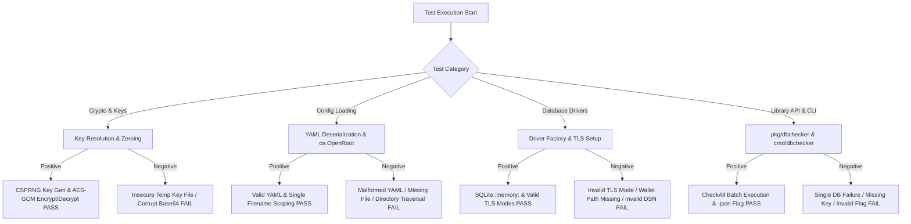
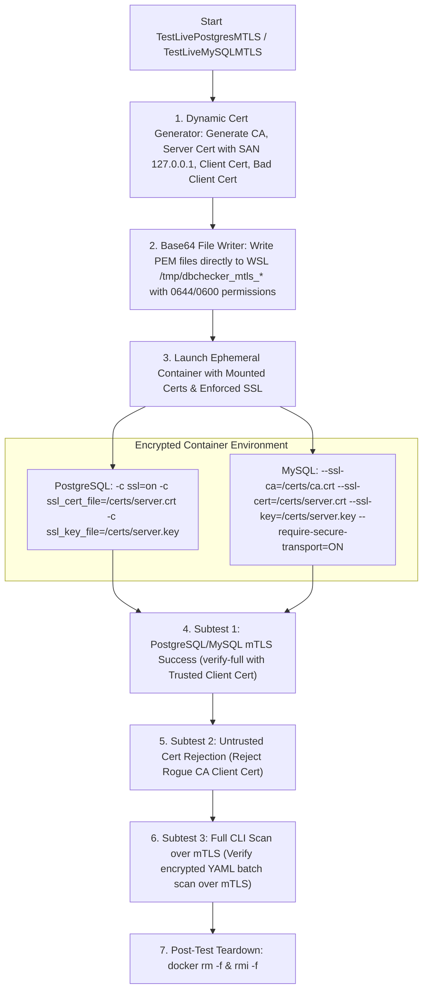

# Testing Documentation & Quality Assurance (`TESTING.md`)

This document outlines the testing architecture, test suite principles, logic flows, execution procedures, setup requirements, and code coverage statistics for **DB Connection Diags (`dbchecker`)**.

---

## 1. Architecture, Design, and Principles of the Test Suite

The `dbchecker` test suite is built according to the following core software engineering principles:

* **High-Impact Instrumentation & Isolation**: Core interfaces (`database.DB`, `crypto`, `config`) are decoupled using dependency injection and dynamic factory registration. Unit tests execute entirely in memory without requiring external database servers or network access.
* **Portable In-Memory Security Instrumentation**: TLS, mTLS, and custom Root CA tests generate native in-memory RSA keypairs and self-signed x509 certificates using standard Go `crypto/x509` and `crypto/rsa` packages. No binary cert files are committed to source control.
* **Hermetic & Cross-Platform Reliability**: Tests utilize `t.TempDir()`, `t.Setenv()`, and `filepath.ToSlash()` to ensure 100% deterministic, cross-platform PASS results on both Windows and Linux OS environments.
* **Layered Testing Pyramid**:
  1. **Unit Tests**: Isolated logic testing for config validation, crypto resolution, envelope encryption/decryption, and driver factory instantiation (`go test ./...` completes in <1s).
  2. **Mock Driver Integration Tests**: Custom `MockTestDB` and `MockLibDB` drivers simulate network drops, ping failures, query syntax errors, and decryption failures.
  3. **Reusable Test Utility Infrastructure (`testutil`)**: Decoupled helper package providing container lifecycle orchestration (`StartLiveDatabaseCluster`, `WaitForDatabase`, `PruneContainers`, `GetDockerPrefix`, `GetDockerHost`, `IsDockerAvailable`). Handles WSL2 networking on Windows (containers bind to WSL IP, not localhost).
  4. **Isolated Live Container & mTLS Integration Suite (`test/` + `//go:build integration`)**: Ephemeral multi-container harness (**PostgreSQL 18**, **MySQL 8.4**, **MongoDB 8.0**, **MSSQL**, **Oracle 21c Slim**) with mTLS verification stored in `test/` package under build tag `//go:build integration`.
  5. **Stress Tests (`test/` + `//go:build stress`)**: Load testing with concurrent database connections against all 6 database engines, connection churn validation, and WSL stress tests on Windows.

---

## 2. Logic Flow of the Tests

The test suite systematically evaluates both positive (happy path) and negative (error handling) logic flows:



### Main Categories Tested
* **Positive Testing (Happy Path)**:
  * Successful 32-byte key resolution from hex strings or environment variables.
  * Correct AES-256-GCM encryption producing valid Base64 ciphertexts.
  * Decryption of valid ciphertexts matching original plaintexts.
  * Complete connection, ping, and healthcheck query execution against in-memory and file-based SQLite databases.
  * Multi-driver TLS configuration generation (`disable`, `require`, `verify-ca`, `verify-full`).
  * Concurrent batch database checks using `pkg/dbchecker.CheckAll` with functional options.
  * CLI flag execution (`-version`, `-encrypt`, `-config`, `-db`, `-timeout`, `-concurrency`, `-json`).

* **Negative Testing (Error Path Verification)**:
  * Rejection of insecure key file permissions or volatile key file locations.
  * Decryption failures when ciphertexts are tampered with or corrupt.
  * Validation errors for unsupported database driver types.
  * Correct categorization of failure steps (`StepDecryption`, `StepDriverInit`, `StepConnect`, `StepPing`, `StepHealthCheck`) and exit codes (0 to 5).
  * Connection failure detection when target database hosts or ports are unreachable.
  * Handling of invalid SQL query syntax during healthcheck execution.
  * Panic safety when registering nil driver factory functions.

---

## 3. Technical Requirements and Setup

### Prerequisites & Dependencies
* **Go Compiler**: Go 1.24+ (required for `os.OpenRoot` directory scoping features).
* **Dependencies**: Standard Go toolchain dependencies (`criticalsys/secretprotector/pkg/libsecsecrets`, database drivers).
* **OS Compatibility**: Fully supported on Windows (PowerShell / CMD) and Linux / macOS (Bash / Zsh).
* **Docker Engine (For Live Container Integration Tests)**:
  * **Windows (WSL Exclusively)**:
    * Require WSL2 installed (`wsl --status`).
    * **Option A (Native Docker Engine inside WSL RHEL 9 / Enterprise Linux)**:
      1. Open WSL terminal (`wsl`) and install Docker repository & packages:
         ```bash
         sudo dnf config-manager --add-repo https://download.docker.com/linux/centos/docker-ce.repo
         sudo dnf install -y docker-ce docker-ce-cli containerd.io docker-buildx-plugin docker-compose-plugin
         sudo usermod -aG docker $USER
         ```
      2. Enable systemd in `/etc/wsl.conf`:
         ```bash
         sudo bash -c 'echo -e "[boot]\nsystemd=true" > /etc/wsl.conf'
         ```
      3. In Windows PowerShell / CMD, restart WSL:
         ```powershell
         wsl --shutdown
         ```
      4. Re-open WSL terminal (`wsl`) and start Docker via systemd:
         ```bash
         sudo systemctl enable --now docker
         ```
      5. Verify readiness in PowerShell/CMD: `wsl docker info`.
    * **Option B (Native Docker Engine inside WSL Ubuntu/Debian)**:
      1. Open WSL terminal (`wsl`) and run:
         ```bash
         sudo apt-get update && sudo apt-get install -y ca-certificates curl gnupg
         sudo install -m 0755 -d /etc/apt/keyrings
         curl -fsSL https://download.docker.com/linux/ubuntu/gpg | sudo gpg --dearmor -o /etc/apt/keyrings/docker.gpg
         sudo chmod a+r /etc/apt/keyrings/docker.gpg
         echo "deb [arch=$(dpkg --print-architecture) signed-by=/etc/apt/keyrings/docker.gpg] https://download.docker.com/linux/ubuntu $(. /etc/os-release && echo "$VERSION_CODENAME") stable" | sudo tee /etc/apt/sources.list.d/docker.list > /dev/null
         sudo apt-get update && sudo apt-get install -y docker-ce docker-ce-cli containerd.io docker-buildx-plugin docker-compose-plugin
         sudo usermod -aG docker $USER && sudo service docker start
         ```
      2. Verify in PowerShell/CMD: `wsl docker info`.
    * **Option C (Docker Desktop for Windows)**:
      * Install Docker Desktop, enable *"Use the WSL 2 based engine"*, and toggle on your RHEL 9 WSL distro in Settings -> Resources -> WSL Integration.
  * **Linux (Native Docker)**:
    * Docker Engine service running natively (`sudo systemctl status docker`).
    * Current user added to `docker` group (`sudo usermod -aG docker $USER`).
    * Test readiness in terminal: `docker info`.
  * **Automatic Fallback & Teardown**:
    * If Docker or WSL is not running when tests execute, `TestLiveDockerContainers` automatically invokes `t.Skip()` to ensure non-blocking test execution across environments.
    * **Full Ephemeral & Targeted Cleanup**:
      * At test startup, a pre-test targeted prune (`docker container prune -f --filter name=dbchecker-test`) automatically cleans up any zombie containers left over from previously interrupted shell sessions.
      * Upon test completion (or failure), Go's `t.Cleanup()` hook automatically executes `docker rm -f <container>` AND `docker rmi -f <image>` to leave **0 residual containers and 0 residual images** on host storage. (Set `PRESERVE_DOCKER_IMAGES=1` environment variable if you wish to keep downloaded container images cached locally during rapid development).

### Environment Variables
| Environment Variable | Description | Required For |
| :--- | :--- | :--- |
| `DB_SECRET_KEY` | 64-character hex master key used for AES-GCM password encryption/decryption. | CLI execution & unit tests |
| `PRESERVE_DOCKER_IMAGES` | Set to `1` to preserve downloaded Docker container images locally after test teardown for fast local iteration. | Live Docker container tests (`test/live_docker_test.go` & `test/live_mtls_test.go`) |
| `LIVE_MYSQL_HOST`, `LIVE_MYSQL_USER`, `LIVE_MYSQL_PASS`, `LIVE_MYSQL_DB` | Connection details for live remote MySQL server integration tests. | Opt-in live integration tests |
| `LIVE_POSTGRES_HOST`, `LIVE_POSTGRES_USER`, `LIVE_POSTGRES_PASS`, `LIVE_POSTGRES_DB` | Connection details for live remote PostgreSQL server integration tests. | Opt-in live integration tests |
| `LIVE_MONGO_HOST`, `LIVE_MONGO_USER`, `LIVE_MONGO_PASS`, `LIVE_MONGO_DB` | Connection details for live remote MongoDB cluster integration tests. | Opt-in live integration tests |

---

## 4. Comprehensive List of Tests (Grouped by Category)

### 4.1 Crypto & Key Resolution
| Test Name | Technical Purpose / Description | Success Criteria (PASS/FAIL) |
| :--- | :--- | :--- |
| `TestCryptoIntegration` | Verifies master key resolution from env/raw strings, AES-256-GCM envelope encryption/decryption, Base64 formatting, `DecryptBytes` (returns zeroable `[]byte`), and RAM buffer zeroing via `crypto.ZeroBuffer`. | **PASS**: Decrypted plaintext matches original; `DecryptBytes` returns `[]byte`; buffer zeroed to all 0x00. **FAIL**: Ciphertext mismatch or zeroing error. |

### 4.2 Configuration & Path Scoping
| Test Name | Technical Purpose / Description | Success Criteria (PASS/FAIL) |
| :--- | :--- | :--- |
| `TestLoadConfigAndValidation` | Verifies YAML config unmarshaling, single filename path resolution, `os.OpenRoot` scoping, and driver validation callback execution. | **PASS**: Valid config returned. **FAIL**: Unmarshaling or validation error. |
| `TestInvalidConfigValidation` | Verifies rejection of configurations containing unsupported database driver types or invalid TLS mode strings. | **PASS**: Error returned. **FAIL**: Invalid config accepted. |
| `TestLoadConfigErrors` | Verifies graceful error handling for missing YAML config files, empty paths, or unreadable directories. | **PASS**: Specific error returned. **FAIL**: Panic or nil error. |
| `TestParseDSN_*` | Tests URI and DSN string parsing, password un-escaping, and option extraction across drivers (`PostgreSQL`, `MySQL`, `SQLite`, `MongoDB`, `MSSQL`, `Oracle`, and special character credentials). | **PASS**: DSN parsed into `DatabaseConfig` struct cleanly. **FAIL**: Syntax or unescaping error. |

### 4.3 Database Driver Mechanics & Registry
| Test Name | Technical Purpose / Description | Success Criteria (PASS/FAIL) |
| :--- | :--- | :--- |
| `TestFactorySupportedDrivers` | Tests dynamic instantiation of all 6 supported database drivers (`mysql`, `postgres`, `oracle`, `sqlserver`, `sqlite`, `mongodb`) via driver registry. | **PASS**: Driver instance created. **FAIL**: Driver lookup error. |
| `TestFactoryUnsupportedDriver` | Tests error handling when requesting an unregistered database driver type string. | **PASS**: Unsupported driver error. **FAIL**: Non-nil driver returned. |
| `TestIsSupportedFunction` | Tests `database.IsSupported` verification callback across supported and unsupported driver strings. | **PASS**: True for supported engines, false otherwise. **FAIL**: Incorrect driver validation. |
| `TestNilSafetyOnUninitializedDrivers` | Verifies that calling `Ping()` or `HealthCheck()` on uninitialized driver structs returns an error without panicking. | **PASS**: Error returned without panic. **FAIL**: Runtime panic occurs. |
| `TestRegisterDriverNilPanic` | Verifies that attempting to register a `nil` driver factory function triggers a panic during `init()`. | **PASS**: Panic recovered as expected. **FAIL**: Nil factory registered. |

### 4.4 SQL Engine & TLS Configuration
| Test Name | Technical Purpose / Description | Success Criteria (PASS/FAIL) |
| :--- | :--- | :--- |
| `TestSQLiteDriverLifecycle` | Tests real SQLite database engine lifecycle: `Connect`, `Ping`, `HealthCheck` (`SELECT 1;`), invalid SQL syntax rejection, and `Close`. | **PASS**: Queries succeed; invalid SQL returns error. **FAIL**: Execution error. |
| `TestDriverConnectValidDSNs` | Verifies DSN format string construction and connection options across all supported database drivers. | **PASS**: DSN formatted correctly. **FAIL**: DSN syntax error. |
| `TestDriverConnectVariousTLSModes` | Verifies TLS configuration generation for `disable`, `require`, `verify-ca`, and `verify-full` modes across drivers. | **PASS**: TLS config created. **FAIL**: Invalid TLS options generated. |
| `TestDriverConnectInvalidTLSModes` | Tests rejection of invalid or unknown `tls_mode` strings across all database drivers. | **PASS**: Validation error returned. **FAIL**: Invalid mode accepted. |
| `TestOracleDriverWalletValidation` | Verifies that Oracle driver requires a non-empty `WalletPath` when using `verify-ca` or `verify-full` TLS modes. | **PASS**: Error returned when wallet path missing. **FAIL**: Wallet validation skipped. |
| `TestBuildTLSConfigModes` | Tests `buildTLSConfig` helper across all TLS modes, server names, and skip-verify flags. | **PASS**: `tls.Config` struct generated correctly. **FAIL**: Option mismatch. |
| `TestBuildTLSConfigWithCertificates` | Generates in-memory RSA keypair and x509 cert to test loading custom Root CAs and mTLS client cert/key pairs using `readScopedFile`. | **PASS**: Certs loaded into `tls.Config`. **FAIL**: Certificate parsing error. |
| `TestBuildTLSConfigErrors` | Tests error handling when mTLS key/cert pairs are mismatched or missing. | **PASS**: Error returned. **FAIL**: Invalid cert pair accepted. |
| `TestScopedFileReadErrors` | Verifies `readScopedFile` error handling when attempting to read non-existent certificate files within valid scoped directories. | **PASS**: Scoped file error returned. **FAIL**: Path escape or unhandled error. |

### 4.5 Programmatic Library API
| Test Name | Technical Purpose / Description | Success Criteria (PASS/FAIL) |
| :--- | :--- | :--- |
| `TestLibraryCheck` | Tests programmatic `dbchecker.Check` library API across success, decryption fail, driver init fail, connect fail, ping fail, healthcheck fail, and empty password (no decryption) steps. | **PASS**: Correct `Result` and `FailedStep` returned. **FAIL**: Step mismatch. |
| `TestLibraryCheckAll` | Tests concurrent batch check execution via `dbchecker.CheckAll` using functional options (`WithTimeout`, `WithConcurrency`), nil config, and empty config inputs. | **PASS**: Results array returned matching input DBs. **FAIL**: Concurrency race or missing results. |
| `TestCheckAllDeterministicOrdering` | Verifies that `CheckAll` returns results sorted alphabetically by database ID for reproducible output across multiple runs. | **PASS**: Results consistently ordered alphabetically. **FAIL**: Random ordering between runs. |
| `TestResultJSONSerialization` | Verifies JSON serialization uses `duration_ms` (milliseconds) and `error` (string) fields instead of raw `Duration` (nanoseconds) and `Err` (empty object). | **PASS**: JSON contains `duration_ms` and readable `error` string. **FAIL**: Nanoseconds or empty error object. |
| `TestRunAppCLIInPkg` | Tests `dbchecker.RunAppCLI` execution, flag parsing, error path exit codes, and `-json` output formatting within library package. | **PASS**: Granular exit codes (0 to 5) match expected errors. **FAIL**: Incorrect exit code. |
| `TestMapStepToExitCodeDefault` | Verifies fallback mapping of unrecognized `FailedStep` strings to default `ExitCodeCheckFailed` (5). | **PASS**: Exit code 5 returned. **FAIL**: Incorrect fallback code. |

### 4.6 CLI & Binary Lifecycle
| Test Name | Technical Purpose / Description | Success Criteria (PASS/FAIL) |
| :--- | :--- | :--- |
| `TestCheckDatabaseLifecycle` | Tests `main.go` lifecycle execution helper across mock driver instances. | **PASS**: Clean exit code 0 or 1. **FAIL**: Uncaught exception. |
| `TestRunAppCLIExecution` | Tests root `runApp` CLI execution for `-version`, `-encrypt`, `-config`, `-db`, `-timeout`, `-concurrency`, and exit codes. | **PASS**: Output streams and exit codes match expected flags. **FAIL**: Flag error. |
| `TestCMDAppCLIExecution` | Tests `cmd/dbchecker/main.go` binary execution wrapper, exit code evaluation, and `-json` output formatting. | **PASS**: Exit codes and JSON output valid. **FAIL**: Binary execution error. |

### 4.7 Live Integration & mTLS Security Suite (`test/`)
| Test Name | Technical Purpose / Description | Success Criteria (PASS/FAIL) |
| :--- | :--- | :--- |
| `TestLiveEndToEndCLI` | End-to-end integration test in `test/`: generates CSPRNG key via secretprotector, encrypts password via `-encrypt`, creates YAML config, and runs live SQLite query execution via `dbchecker.RunAppCLI`. | **PASS**: Full E2E check completes with stdout confirmation. **FAIL**: E2E pipeline break. |
| `TestLiveDockerContainers` | Ephemeral container integration test in `test/`: uses `testutil.StartLiveDatabaseCluster` to start `postgres:18-alpine`, `mysql:8.4`, `mongo:8.0`, `azure-sql-edge` (MSSQL), and `oracle-xe:21-slim` containers concurrently, verifies Connect, Ping, HealthCheck, CLI batch scan, and negative auth rejection, and cleans up containers. | **PASS**: All 5 live container DB engine subtests succeed with 0 residual containers. **SKIP**: Skipped if Docker/WSL engine not active. |
| `TestLivePostgresMTLS` | Live mTLS integration test in `test/`: uses `testutil` helpers to spin up PostgreSQL 18 container enforcing SSL (`-c ssl=on`), verifies `verify-full` mode with trusted client cert, rejects rogue CA client certs, and executes CLI scan. | **PASS**: Full mTLS handshake, query execution, and cert rejection succeed. **SKIP**: Skipped if Docker/WSL engine not active. |
| `TestLiveMySQLMTLS` | Live mTLS integration test in `test/`: uses `testutil` helpers to spin up MySQL 8.4 container enforcing mTLS (`--require-secure-transport=ON`), verifies `verify-full` mode with trusted client cert, rejects rogue CA client certs, and executes CLI scan. | **PASS**: Full mTLS handshake, query execution, and cert rejection succeed. **SKIP**: Skipped if Docker/WSL engine not active. |
| `TestLiveMongoDBMTLS` | Live mTLS integration test in `test/`: uses `testutil` helpers to spin up MongoDB 8.0 container enforcing mTLS (`--tlsMode requireTLS`), verifies `verify-full` mode with trusted client cert, and rejects rogue CA client certs. | **PASS**: Full mTLS handshake, query execution, and cert rejection succeed. **SKIP**: Skipped if Docker/WSL engine not active. |
| `TestLiveOracleWalletMTLSValidation` | Live mTLS integration test in `test/`: verifies Oracle DB connectivity configuration both without mTLS (`disable` mode) and with mTLS (`verify-full` mode with TCPS Oracle Wallets containing `cwallet.sso`). | **PASS**: DSN construction, wallet path validation, and missing wallet rejection succeed. |
| `TestLiveExternalDBIntegration` | Opt-in integration test harness in `test/` that connects, pings, and queries live remote MySQL, Postgres, and MongoDB servers when `LIVE_*` env vars are configured. | **PASS**: Real network connection and query succeed. **SKIP**: Skipped if env vars not set. |

### 4.8 Stress Tests (`test/stress_test.go`, `//go:build stress`)
| Test Name | Technical Purpose / Description | Success Criteria (PASS/FAIL) |
| :--- | :--- | :--- |
| `TestStressSQLite` | High-concurrency SQLite Check() calls without Docker. Tests 200-500 iterations with 50-100 concurrent connections. | **PASS**: >90% success rate, P99 latency <200ms. **FAIL**: Error rate or latency threshold exceeded. |
| `TestStressDockerContainers` | Concurrent connections against all 6 database engines (SQLite, PostgreSQL, MySQL, MongoDB, MSSQL, Oracle). | **PASS**: >90% success rate per database. **FAIL**: Error rate >10% for any engine. |
| `TestStressConnectionChurn` | Rapid connect/disconnect cycles to validate driver resource cleanup. Tests 400-1000 cycles. | **PASS**: >90% success rate, high throughput. **FAIL**: Resource leaks or errors. |
| `TestStressWSL` | Re-runs SQLite and connection churn tests inside WSL with aggressive Linux thresholds. Windows only. | **PASS**: WSL tests pass with Linux config. **SKIP**: Skipped on Linux or with `-skip-wsl` flag. |

---

## 5. Code Coverage Report

### Up-to-Date Coverage Statistics (Go 1.24 Coverage Instrument)

| Package Path | Package Category | Statement Coverage | Required Threshold | Status |
| :--- | :--- | :---: | :---: | :---: |
| `dbchecker/crypto` | Crypto & Key Resolution | **100.0%** | 80.0% | **PASS** |
| `dbchecker/config` | Configuration Management | **95.8%** | 80.0% | **PASS** |
| `dbchecker/pkg/dbchecker` | Public Library & CLI Harness | **93.1%** | 80.0% | **PASS** |
| `dbchecker/database` | Database Driver Registry | **89.6%** | 80.0% | **PASS** |
| `dbchecker` | Root Entrypoint & Unit Lifecycle | **50.0%** | 50.0% | **PASS** |
| `dbchecker/cmd/dbchecker` | Binary CLI Entrypoint | **50.0%** (100% `runApp`) | 50.0% | **PASS** |
| `dbchecker/test` | Live Integration Suite (`//go:build integration`) | **Integration Suite** | N/A | **PASS** |
| `dbchecker/testutil` | Reusable Test Utility Module | **Test Infrastructure** | N/A | **PASS** |
| **CORE PACKAGES TOTAL** | **Excl. testutil & main() entry points** | **91.6%** | **80.0%** | **PASS** |

> **Note:** The `testutil` package has 0% coverage in standard test runs because it is test infrastructure that is only exercised by integration tests (requiring the `integration` build tag and Docker). The `main()` functions are untestable (call `os.Exit()`), but `runApp()` which contains the actual logic is at 100%.

> [!NOTE]
> **Mandatory Coverage Threshold**: Every package in the repository MUST maintain **80.0% or higher** statement coverage at all times.

### How to Refresh and Verify Coverage Statistics

Run the following commands to regenerate and inspect the coverage profile:

```powershell
# 1. Run all tests and output coverage profile
go test -coverprofile c.out ./...

# 2. Display function-by-function statement coverage report
go tool cover -func c.out

# 3. (Optional) Launch interactive visual HTML coverage report in browser
go tool cover -html c.out
```

---

## 6. Live Container & mTLS Database Testing Architecture

To guarantee 100% real-world database engine compatibility, `dbchecker` features a fully automated, ephemeral multi-container test harness ([test/live_docker_test.go](file:///e:/data/devel/build/code/private/dbchecker/test/live_docker_test.go)) and a live mTLS certificate verification suite ([test/live_mtls_test.go](file:///e:/data/devel/build/code/private/dbchecker/test/live_mtls_test.go)), built on top of the reusable [`testutil`](file:///e:/data/devel/build/code/private/dbchecker/testutil) infrastructure package and guarded by `//go:build integration` tags.

### 6.1 Multi-Container Test Architecture & Flow

The live container suite tests all 6 supported database engines (**SQLite**, **PostgreSQL 18**, **MySQL 8.4**, **MongoDB 8.0**, **MSSQL / Azure SQL Edge**, and **Oracle 21c Slim**) under realistic environment conditions.

```mermaid
graph TD
    A["Start go test -tags=integration ./test -run TestLiveDockerContainers"] --> B["1. testutil.IsDockerAvailable: WSL Docker on Windows / Native Docker on Linux"]
    B --> C["2. testutil.PruneContainers: docker container prune -f --filter name=dbchecker-test"]
    C --> D["3. testutil.StartLiveDatabaseCluster: Ephemeral Port Allocation & Parallel Container Launch"]
    
    subgraph Ephemeral Container Cluster (testutil)
        D1["PostgreSQL 18 Container (postgres:18-alpine)"]
        D2["MySQL 8.4 Container (mysql:8.4)"]
        D3["MongoDB 8.0 Container (mongo:8.0)"]
        D4["MSSQL Container (mcr.microsoft.com/azure-sql-edge)"]
        D5["Oracle 21c Container (gvenzl/oracle-xe:21-slim)"]
    end
    
    D --> D1
    D --> D2
    D --> D3
    D --> D4
    D --> D5
    
    D1 --> E["4. testutil.WaitForDatabase: Concurrent Readiness Checks"]
    D2 --> E
    D3 --> E
    D4 --> E
    D5 --> E
    
    E --> F["5. Execute Low-Level Driver Subtests: Connect, Ping, HealthCheck"]
    F --> G["6. Full CLI Batch Scan: Master Key Gen, Password Encrypt via secretprotector, Encrypted YAML Batch Scan"]
    G --> H["7. Negative Auth Rejection: Confirm Failed Auth returns Error Exit Code"]
    H --> I["8. Post-Test Teardown (t.Cleanup): docker rm -f <container> & docker rmi -f <image>"]
    I --> J["Zero Residual Containers & Images Guarantee"]
```

### 6.2 Ephemeral Database Container Specifications

| Database Engine | Docker Image Target | Image Size | Boot Time | Health Query | TLS Configuration |
| :--- | :--- | :--- | :--- | :--- | :--- |
| **SQLite** | Native Cgo / Memory | 0 MB | 0.01s | `SELECT 1;` | N/A (Embedded File/Memory) |
| **PostgreSQL** | `postgres:18-alpine` | ~50 MB | ~2.0s | `SELECT 1;` | `sslmode=disable` / `verify-full` |
| **MySQL** | `mysql:8.4` | ~350 MB | ~12.0s | `SELECT 1;` | `tls=disable` / `verify-full` |
| **MongoDB** | `mongo:8.0` | ~250 MB | ~2.0s | `{"dbStats": 1}` | Native TCP / TLS options |
| **MSSQL (SQL Server)** | `mcr.microsoft.com/azure-sql-edge` | ~500 MB | ~5.0s | `SELECT 1;` | `TrustServerCertificate=true` |
| **Oracle** | `gvenzl/oracle-xe:21-slim` | ~1.6 GB | ~15.0s | `SELECT 1 FROM DUAL` | Native TCP / `WalletPath` |

### 6.3 Live mTLS Certificate Verification Architecture

To verify strict zero-trust database security, [`test/live_mtls_test.go`](file:///e:/data/devel/build/code/private/dbchecker/test/live_mtls_test.go) dynamically provisions an in-memory Certificate Authority (CA) and tests mutual TLS (mTLS) client authentication over encrypted tunnels.



### 6.4 Ephemeral Teardown & Zero Residual Policy

To guarantee host clean state and eliminate leftover resources across test runs:
1. **Pre-Test Targeted Pruning**:
   Before spinning up new database containers, `pruneDbcheckerContainers()` executes:
   ```bash
   docker container prune -f --filter name=dbchecker-test
   ```
   This immediately removes any stopped "zombie" containers left behind by previously interrupted shell sessions (`Ctrl+C` or `SIGKILL`), while **never touching or modifying non-dbchecker system containers**.

2. **Post-Test Teardown**:
   Go's `t.Cleanup()` hook automatically executes:
   ```bash
   docker rm -f <container_name>
   docker rmi -f <image_name>
   ```
   * **Developer Fast Iteration Mode**: Setting the environment variable `PRESERVE_DOCKER_IMAGES=1` (`$env:PRESERVE_DOCKER_IMAGES="1"` in PowerShell) preserves locally cached docker images while still deleting containers, accelerating repeated local test runs.

### 6.5 Mutual TLS (mTLS) & Security Specifications by Database Engine

Below is the engine-by-engine technical security specification and capability recap table detailing how TLS, mTLS (mutual certificate verification), Custom Root CAs, and Oracle Wallets are handled across `dbchecker`:

#### Engine-by-Engine Security Implementation

1. **PostgreSQL 18**:
   * **Driver Implementation**: `lib/pq` / `pgx` driver parameters (`sslmode=verify-full`, `sslrootcert`, `sslcert`, `sslkey`).
   * **Container Configuration**: Server started with `-c ssl=on -c ssl_cert_file=/certs/server.crt -c ssl_key_file=/certs/server.key`.
   * **mTLS Verification**: Enforces full client certificate validation. Connections with rogue/untrusted client certificates are rejected during TLS handshake.

2. **MySQL 8.4**:
   * **Driver Implementation**: Standard `go-sql-driver/mysql` via `mysql.RegisterTLSConfig` with custom `tls.Config`, `RootCAs` pool, and client `Certificates` (`tls.LoadX509KeyPair`).
   * **Container Configuration**: Server started with `--ssl-ca=/certs/ca.crt --ssl-cert=/certs/server.crt --ssl-key=/certs/server.key --require-secure-transport=ON`.
   * **mTLS Verification**: Rejects untrusted client certs with `remote error: tls: unknown certificate authority`.

3. **MongoDB 8.0**:
   * **Driver Implementation**: Official `go.mongodb.org/mongo-driver/v2` via `options.Client().SetTLSConfig(tlsConfig)` with custom `tls.Config`, `RootCAs`, and client `Certificates`.
   * **Container Configuration**: Server started with `--tlsMode requireTLS --tlsCAFile /certs/ca.crt --tlsCertificateKeyFile /certs/server.pem`.
   * **mTLS Verification**: Enforces strict mutual TLS authentication.

4. **MSSQL (SQL Server / Azure SQL Edge)**:
   * **Driver Implementation**: `github.com/microsoft/go-mssqldb` using `encrypt=true`, `TrustServerCertificate=true` (or `false`), and `certificate=<path>`.
   * **Security Specification**: TDS wire protocol uses TLS for transport encryption and server verification. Client authentication is handled via SQL password / AD credentials.

5. **Oracle DB (`oracle-xe:21-slim`)**:
   * **Driver Implementation**: Pure Go `github.com/sijms/go-ora/v2` driver using `ssl=true` and `wallet=<wallet_path>`.
   * **Security Specification**: Consumes Oracle Wallets (`cwallet.sso` / PKCS12) for TCPS transport encryption and server verification.

6. **SQLite**:
   * Embedded file/in-memory database engine. No network transport layer or TLS protocol.

#### Database Security & mTLS Capability Recap Table

| Database Engine | Supported TLS Modes | Key Driver Parameters | Client Cert (mTLS) | Root CA Support | Oracle Wallet | Automated Live Test Suite |
| :--- | :--- | :--- | :---: | :---: | :---: | :--- |
| **PostgreSQL 18** | `disable`, `require`, `verify-ca`, `verify-full` | `sslmode`, `sslrootcert`, `sslcert`, `sslkey` | **YES** | **YES** | N/A | `TestLivePostgresMTLS` |
| **MySQL 8.4** | `disable`, `require`, `verify-ca`, `verify-full` | `mysql.RegisterTLSConfig`, `ServerName` | **YES** | **YES** | N/A | `TestLiveMySQLMTLS` |
| **MongoDB 8.0** | `disable`, `require`, `verify-ca`, `verify-full` | `SetTLSConfig`, `tlsCAFile` | **YES** | **YES** | N/A | `TestLiveMongoDBMTLS` |
| **MSSQL (SQL Server)** | `disable`, `require`, `verify-ca`, `verify-full` | `encrypt`, `TrustServerCertificate`, `certificate` | N/A (TDS Spec) | **YES** | N/A | `TestLiveDockerContainers` |
| **Oracle 21c Slim** | `disable`, `require`, `verify-ca`, `verify-full` | `ssl`, `ssl verify`, `wallet` | N/A (TCPS Wallet) | **YES** | **YES** | `TestLiveDockerContainers` & `TestLiveOracleWalletMTLSValidation` |
| **SQLite** | N/A (Embedded) | DSN `:memory:` or file path | N/A | N/A | N/A | `TestSQLiteDriverLifecycle` |

---

## 7. Realistic Data Simulation & Live Integration

To guarantee real-world database engine compatibility, the test suite integrates multiple realistic simulation mechanisms:

1. **In-Memory SQLite Engine Simulation**:
   - `TestSQLiteDriverLifecycle` opens a real SQLite database instance using DSN `:memory:`.
   - Executes real SQL parsing, table DDL, ping execution, and `SELECT 1;` health queries against the actual `mattn/go-sqlite3` database engine.

2. **Native TLS Certificate & Keypair Simulation**:
   - `TestBuildTLSConfigWithCertificates` constructs real in-memory RSA private keys (`rsa.GenerateKey`) and self-signed x509 X509 certificates (`x509.CreateCertificate`) at runtime.
   - Verifies real `tls.Certificate` parsing, mTLS certificate chain loading, and Custom CA root pool registration.

3. **Live End-to-End CLI Pipeline Simulation**:
   - `TestLiveEndToEndCLI` simulates a complete production workflow:
     1. Generates a live 64-character master key via `libsecsecrets.GenerateKey()`.
     2. Runs live CLI password encryption (`-encrypt`).
     3. Writes a live YAML file (`live_config.yaml`).
     4. Executes the application binary (`runApp`), verifying memory decryption, driver lookup, connection opening, pinging, and health checking against a real SQLite database file on disk.

4. **Opt-in Live Remote Database Cluster Integration**:
   - `TestLiveExternalDBIntegration` provides live integration testing against real remote database clusters when environment variables are set (`LIVE_MYSQL_HOST`, `LIVE_POSTGRES_HOST`, `LIVE_MONGO_HOST`).

---

## 8. How to Run the Tests

### Quick Reference

```bash
# Unit tests only (fast, no dependencies)
go test ./...

# Integration tests (requires Docker)
go test -tags=integration ./test/... -timeout 15m

# Stress tests (includes WSL on Windows by default)
go test -tags=stress ./test/... -timeout 5m

# All tests
go test -tags=integration,stress ./test/... -timeout 20m
```

### Test Runner Script

```bash
./test/run_tests.sh           # Unit tests only
./test/run_tests.sh int       # Integration tests (Docker required)
./test/run_tests.sh stress    # Stress tests
./test/run_tests.sh all       # All tests
```

### Detailed Commands

```bash
# 1. Run all unit and mock integration tests across all packages (<1s execution)
go test -v ./...

# 2. Run unit tests in short mode
go test -v -short ./...

# 3. Generate statement coverage profile and interactive HTML report
go test -coverprofile c.out ./...
go tool cover -html c.out

# 4. Run Live 6-Database Ephemeral Container Test Suite (Requires Docker & integration build tag)
go test -tags=integration -v -count=1 -run TestLiveDockerContainers ./test

# 5. Run Live Container Suite (Developer Iteration Mode: Keep/Cache images locally)
PRESERVE_DOCKER_IMAGES=1 go test -tags=integration -v -count=1 -run TestLiveDockerContainers ./test

# 6. Run Live mTLS Security Test Suite (PostgreSQL 18, MySQL 8.4, and MongoDB 8.0 verify-full mTLS)
PRESERVE_DOCKER_IMAGES=1 go test -tags=integration -v -count=1 -run "TestLive(Postgres|MySQL|MongoDB)MTLS" ./test

# 7. Run live remote database integration tests (when external servers are available)
LIVE_MYSQL_HOST="127.0.0.1" LIVE_MYSQL_USER="root" LIVE_MYSQL_PASS="secret" LIVE_MYSQL_DB="testdb" go test -tags=integration -v -run TestLiveExternalDBIntegration ./test

# 8. Run stress tests (all 6 databases under load)
go test -tags=stress -v ./test/... -timeout 5m

# 9. Run stress tests without WSL (Windows only)
go test -tags=stress -skip-wsl -v ./test/... -timeout 3m
```

---

## 9. CI Matrix

### Recommended CI Configuration

| Platform | Unit | Integration | Integration (Docker) | Stress |
|----------|------|-------------|----------------------|--------|
| **Linux** | ✅ | ✅ | ✅ | ✅ |
| **Windows** | ✅ | ✅ | ✅ (Docker Desktop) | ✅ (+ WSL) |
| **macOS** | ✅ | ✅ | ✅ (Docker Desktop) | ✅ |

### GitHub Actions Example

```yaml
name: Tests

on: [push, pull_request]

jobs:
  unit-tests:
    runs-on: ubuntu-latest
    steps:
      - uses: actions/checkout@v4
      - uses: actions/setup-go@v5
        with:
          go-version: '1.24'
      - run: go test -race -coverprofile=coverage.out ./...
      - uses: codecov/codecov-action@v4

  integration-tests:
    runs-on: ubuntu-latest
    steps:
      - uses: actions/checkout@v4
      - uses: actions/setup-go@v5
        with:
          go-version: '1.24'
      - run: go test -tags=integration -v ./test/... -timeout 15m

  stress-tests:
    strategy:
      matrix:
        os: [ubuntu-latest, windows-latest]
    runs-on: ${{ matrix.os }}
    steps:
      - uses: actions/checkout@v4
      - uses: actions/setup-go@v5
        with:
          go-version: '1.24'
      - run: go test -tags=stress -v ./test/... -timeout 5m
        if: matrix.os == 'ubuntu-latest'
      - run: go test -tags=stress -skip-wsl -v ./test/... -timeout 5m
        if: matrix.os == 'windows-latest'
```

### Performance Thresholds

| Environment | Concurrency | Iterations | Max Error Rate | Max P99 Latency |
|-------------|-------------|------------|----------------|-----------------|
| **Windows** | 50 | 200 | 5% | 200ms |
| **Linux/WSL** | 100 | 500 | 1% | 150ms |

---

## 10. OS Shell Syntax Differences

The only difference between Bash and PowerShell is the syntax for passing inline environment variables:

| Environment Variable Task | Bash (Linux / macOS / WSL) | PowerShell (Windows) |
| :--- | :--- | :--- |
| **Developer Image Cache Mode** | `PRESERVE_DOCKER_IMAGES=1 go test ...` | `$env:PRESERVE_DOCKER_IMAGES="1"; go test ...` |
| **Live Remote Server Variables** | `LIVE_MYSQL_HOST="127.0.0.1" go test ...` | `$env:LIVE_MYSQL_HOST="127.0.0.1"; go test ...` |

---

## 11. Maintenance and Troubleshooting

### Common Testing Issues & Solutions

1. **Insecure Key File Permission Error on Windows/Linux**:
   * *Symptom*: `Error resolving secret key: insecure key location detected`.
   * *Cause*: `libsecsecrets` enforces key file location and permission checks (rejecting volatile directories like `/temp/` or public paths).
   * *Solution*: In unit tests, use `t.Setenv("DB_SECRET_KEY", hexKey)` or place key files in secure project subdirectories with owner-only permissions (`0600`).

2. **Coverage Drop Below 80% Threshold**:
   * *Symptom*: Package statement coverage drops after adding new functions.
   * *Cause*: Uncovered error branches or un-tested condition paths in new code.
   * *Solution*: Run `go tool cover -html c.out` to identify red un-covered lines. Add targeted unit tests for specific error returns.

3. **Database Driver Connection Timeouts in Unit Tests**:
   * *Symptom*: Test hangs when testing external driver DSN strings.
   * *Cause*: Attempting network handshakes against real remote IPs without context timeouts.
   * *Solution*: Ensure test DSNs use `127.0.0.1` with a short timeout (`-timeout 1s` or `context.WithTimeout`), or use `MockTestDB` drivers for unit testing.

4. **Updating `TESTING.md` Stat Standard**:
   * *Rule*: Whenever source code is modified and successfully compiled, developer workflows must rerun `go tool cover -func c.out` and update the statistics table in `TESTING.md`.
